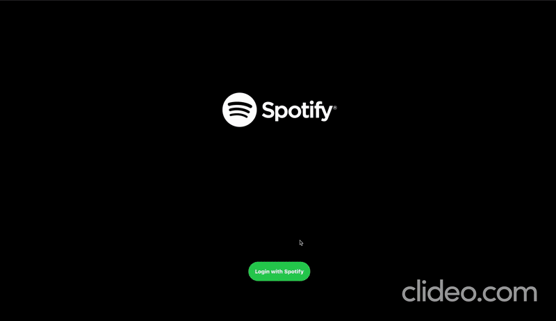

## Spotify

### Challenge

Using purely the mock data available on `src/mocks/data.json`:

- List the available playlists on the Sidebar.
- List the songs from `Discover weekly`, which should be fully interactive:
  1. When a track is selected (clicked), it should appear in the `Player`.
  2. The `Players` UI buttons `prev` and `next` should be fully functional, meaning that when clicked, it should go to the next and previous tracks, respecting the `Discover weekly` tracks list order.

### BONUS

- Make the `shuffle` option fully functional.

### Challenge rules:

1. We expect `production code`.
2. Whole codebase can be changed as you wish.
3. We look for simplicity and not complexity.
4. Use your best judment to make the challenge requirements happen.
